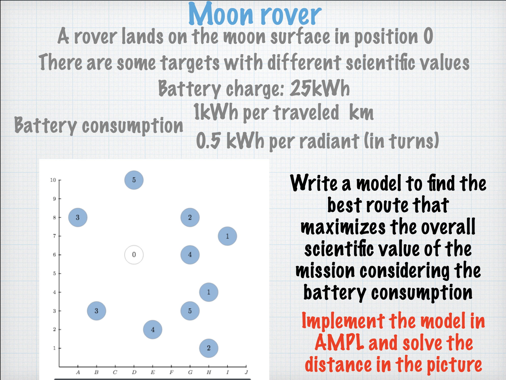
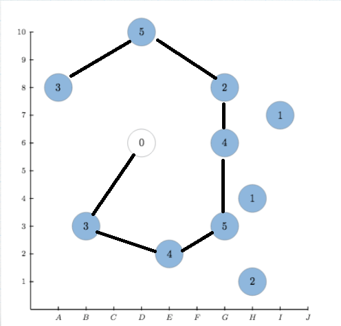

# Moon Rover Mini Projet

This is a mini project for Operation Research Course of Politecnico Di Milano.

We have to model a simple problem and solve it with AMPL.

## Request

### Addictional informations
- We start from node that has 0 value (D,6)
- The initial rotaion can be any (we can face the first selected node)
- We can stop at any node

## Run

First install ampl and then run 
`include rover.run`

## Solution

This is the solution obtained by running the code. It has a total of 26 science points collected.
